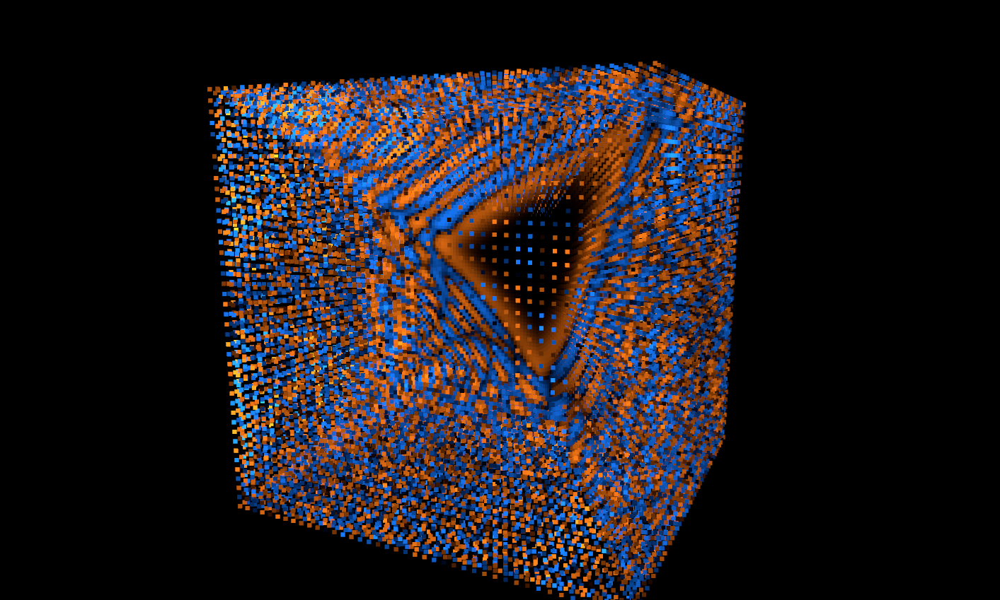
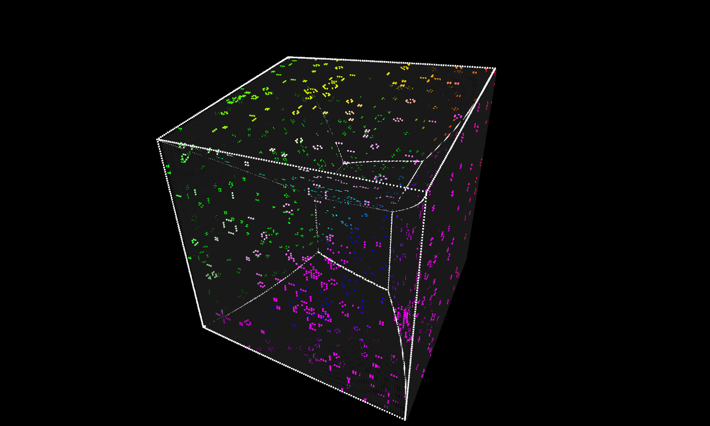

# Hypersurface
A data structure and a set of algorithms for manipulating regular cells on the
N-dimensional hypersurface of a M-dimensional hypercube.

## Examples
Demonstrating the realtime viability of this datastructure is a wave simulation using the 2D finite difference method on the surface of a 4D hypercube.
The visualization looks something like this:


Run it for yourself:
```sh
cargo run --release --example fdm
```

There is also an example for 2D Conway's Game of Life in the `gol` branch:


Run it for yourself:
```sh
git checkout gol
cargo run --release --example fdm
```

There is also 3D life-like game in `gol_3d`, and a 4D life-like game in `gol_4d`. 
